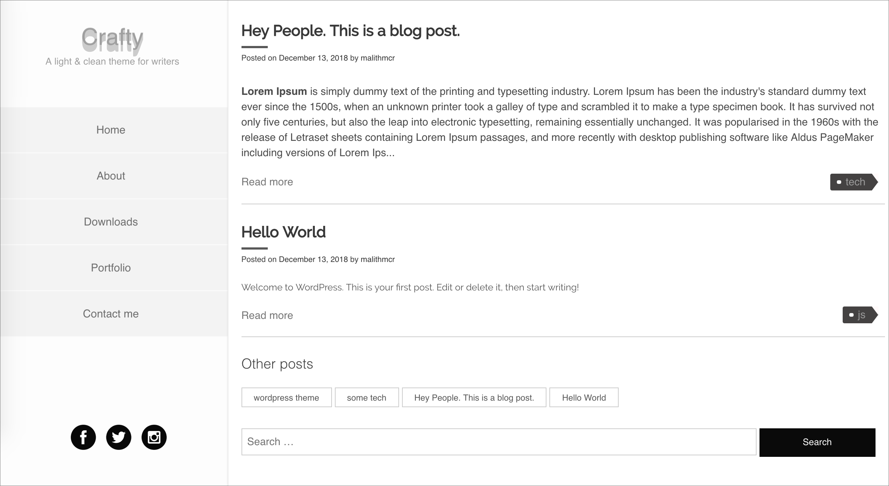

<h1 align="center">
  Crafty
</h1>

<h4 align="center">
  A 💡light & clean Wordpress theme for writers.❤️
</h4>
 

    

## Features

- Clean Code.
- Sassified.
- 3d Logo animation.
- Hover animation.
- Theme options

## Contributing

- Fork it!
- Create your feature branch: `git checkout -b my-new-feature`
- Commit your changes: `git commit -am 'Add some feature'`
- Push to the branch: `git push origin my-new-feature`
- Submit a pull request

## License

[MIT](LICENSE)

    

